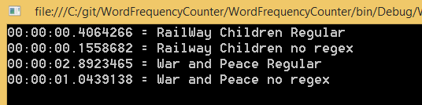

# Word Frequency Counter

This is a technical test to parse text files and count the frequency of words. 

## Requirements

- Write an application that outputs the individual words that appear in a book, and how many times that word appears in the text file.

- The second part is to also output whether the number of times each word appears is a prime number.

The following assumptions can be made:

- Ignore punctuation and capitalisation

- The code should compile and run on a machine with VS/Xamarin and NUnit

It would be beneficial to:

- come up with more than one solution and be able to talk about the pros and cons to each

- ensure the application scales and performs optimally

- Use TDD in the approach to writing the application

## Installation

- git clone git@github.com:thomasdane/wordFrequencyCounter.git

- open the solution in Visual Studio

- Run the tests with TEST --> Run --> All Tests (Or Ctrl + R + A)

- Run the program with F5

## Approach

#### TDD

We don't use TDD at work, but I thoroughly enjoyed using it here. 

I might even start using it for my side-project! It made catching bugs less stressful, and helped me think about the problem.

#### Parsing text

Counting each line of text sequentially would have performance drawbacks for very large books. 

Recently I did some 'hello world' tutorials with multithreading https://github.com/thomasdane/multithreading

So what if rather than parsing the book sequentially, the program loads each line into an array and acts on them concurrently?

My research led me to a fantastic article detailing such an approach: http://cc.davelozinski.com/c-sharp/the-fastest-way-to-read-and-process-text-files

A class called ConcurrentDictionary allows us to keep track of the total word frequency: 

http://geekswithblogs.net/blackrabbitcoder/archive/2011/02/17/c.net-little-wonders-the-concurrentdictionary.aspx

I did some further reading about the limitations of ParallelFor (http://www.i-programmer.info/programming/c/1420-the-perils-of-the-c-parallel-for-.html) and it seemed that counting words would be fine: "it works if the for loop is essentially a set of independent operations"

#### Other languages
There's lots of great literature written in languages other than English, so I added unicode support and tests for non-latin alphabets. 

#### Book length

I included War and Peace as an example, but it is not the longest novel ever written.

https://en.wikipedia.org/wiki/List_of_longest_novels

So I copied War And Peace twice into the one file, producing a book longer than the longest ever book. It is still only 6MB though. This program might have different concerns if we were processing GBs or TBs of text. 

## Other Solutions with Pros and Cons

In terms of a very different solution, it would be great to try this task with F# and a functional approach. Given time, I would love to give it a shot.

Nevertheless, along the way there were various opportunities for other approaches. 

### Benchmarking

I created some interfaces which allowed me to swap in different implementations of the methods. These alternative methods are in a folder called 'SecondVersion'

### Prime numbers

#### Original approach

The prime number calculator is not very sophisticated. It does not skip numbers that are multiples of numbers already tested. For example, once we know that the integer is not divisible by 5

we do not need to check 10, 15, 20 and so on. Initially it did not even stop at the square root of the target number, but I added that later.

There are lots of ways to find primes fast, as discussed here: http://stackoverflow.com/questions/15743192/check-if-number-is-prime-number

#### Alternative

I read that under the hood .NET hardcodes primes to speed up HashHelpers https://www.dotnetperls.com/prime

It made me think about hardcoding a list of smaller primes (less than the max count in War and Peace). The program could first check if the integer exists in the hardcoded array. If not, only then calculate the prime.  

Here is the result: 

You can see that for RailwayChildren (a smaller result set) the hardcoded list was nearly twice as fast.

For War and Peace however (larger result set), the results varied slightly but on average the hardcoded list was slower. Initially I used an Array of primes, so I refactored to use a HashSet, which has O(1) lookups: http://stackoverflow.com/questions/9812020/what-is-the-lookup-time-complexity-of-hashsettiequalitycomparert

However the results were the same! This made me think the bottleneck is not at Calculating Primes. 

So I ran a benchmark against all the methods, first for Railway Children and then for War and Peace. 

It turns out that the WordCounter class is by far the slowest!

### Word Counter

#### Original Approach

My original code is below: 

One theory was that if the line is very long, String.Split creates a large number of string objects. This overhead might mean that parsing by chars is faster http://stackoverflow.com/questions/8784517/counting-number-of-words-in-c-sharp

However when I ran more targeted benchmarks, it seems String.Split is not the main problem:

By far the most expensive code is the loop which replaces the punctuation and then adds/updates the dictionary:

Digging further into that code, the regex performs sometimes twice as slow as the add/update: 

So let's refactor! 

#### Alternative Approach

I swapped out the regex for a comparison based on chars. I also used a StringBuilder to create the word at the end without creating an intermediate string object on each step. 

And the results were much better. The smaller book was less than half the speed! The longer book about 30% faster. 

Checkout the results when run against a file containing two copies of War and Peace:

It's more than twice as fast. Based on some comments online, I tried using a Compiled option: Regex("[^\\p{L}]", RegexOptions.Compiled) but for some reason the results were even slower. 

#### Why is this? 

I could not find any great answers. 

This article lends evidence that Regex.Replace is slow:

https://blogs.msdn.microsoft.com/debuggingtoolbox/2008/04/02/comparing-regex-replace-string-replace-and-stringbuilder-replace-which-has-better-performance/

One suggestion was: 

"this issue may have to do with how the CLR handles Regex in 64-bit.

MS has themselves admitted that XSLT & Regex utilizes 4x more memory than it did in 32-bit."

The best piece of advice I found was that Regex is not suited for this case because the replace is fairly simple:

"Replacing a character is strictly the realm of string/stringbuilder replace and optimized accordingly.

Regex is meant for complicated patterns and has overhead to that end."

#### Pros and Cons

Some people may find the Regex.replace method more readable or intuitive. However it is much slower than the method using char.IsLetter

So I think this would be a conversation to have with the team. Is it actually more readable and intuitive? How often are we going to deal with huge books? It's nice to have both options and be able to bring data to a conversation with the team, customer or business. 

## Optimizations and scaling

- What if someone uploads a book that we have already computed? It would be good to save the results to a database. Then if someone uploads a book, we can first lookup the database and check if we have the results saved.  

- What if we had 1 million users who all wanted a book parsed? Could use more multithreading?The brute force solution might be to spin up multiple instances and process 1 book per instance. I have read about running .NET on AWS Lambda by having node spawn the .NET process http://itmeze.com/2016/01/06/running-c-on-aws-lambda So we could run program on Lambda, and have it run every time a new book is uploaded to S3. 

- Another mini optimisation would be to speed up the FileReader method by pre-allocate the size of the array  http://cc.davelozinski.com/c-sharp/the-fastest-way-to-read-and-process-text-files

## Limitations

- Words with hyphens will have issues. They will be counted correctly, but display incorrectly. For example,
"free-for-all" will be displayed as "freeforall". 

- Similarly, two contracted words will be displayed and counted as one word. For example, "You're" will be displayed and counted as "youre".  This is almost a business/requirements decision - should this be counted as two words? Or is the current behaviour desirable? 

- One improvement I saw in other word frequency counters online was to only count root words. So "You'll" and "You're" would both display as "you" with a count of 2. 

- Using http://www.writewords.org.uk/word_count.asp my results were different for Railway Children. Without seeing their code, it's hard to judge why. However, both that site and myself get different results to http://www.textfixer.com/tools/online-word-counter.php#newText2. It seems there is some variation in counting words.

- there is a 2 GB limit on any object in .Net. As rare as it might be, the program won't be able to handle lines larger than that limit. 

 
## Extensions

- testing for more edge cases and malformed inputs. 

- some kind of UI for people to upload books and see the output. 

- Some word frequency counters online allow the user to exclude common words like 'the', 'to', 'and' etc. That would be a nice feature. If the business/customer desired, it would be easy to create a list of such common words and exclude them from the results. It may even speed up the app by excluding the most common results.

## Thanks

Thank you to Murieann and Francois for giving me the opportunity to take this code test. I really enoyed it and learned so much! About TDD, parallelism, benchmarking, primes, and that, ironically, "In Search of Lost Time" is the longest book ever written!
